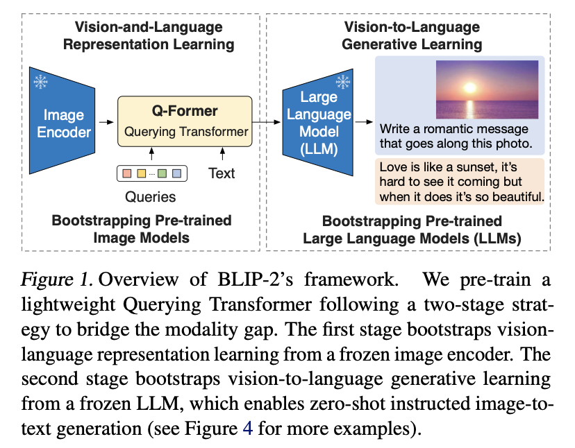
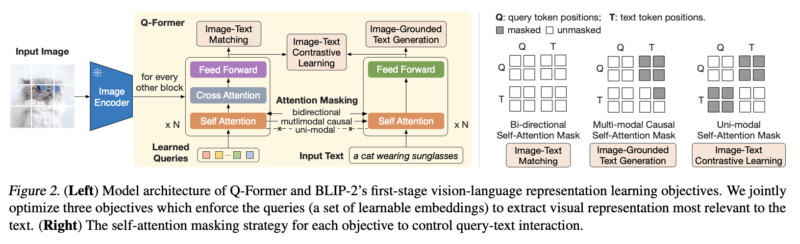
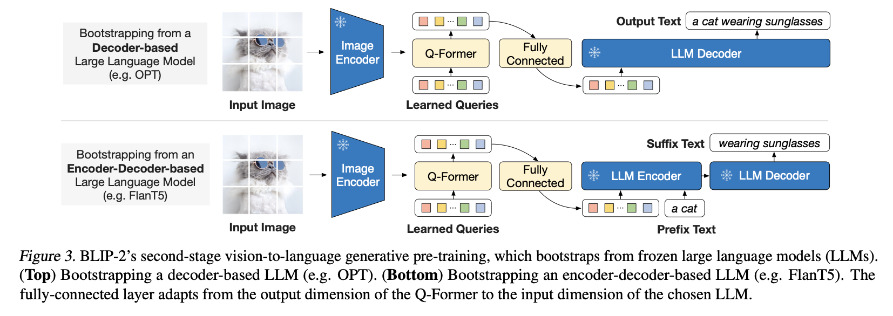
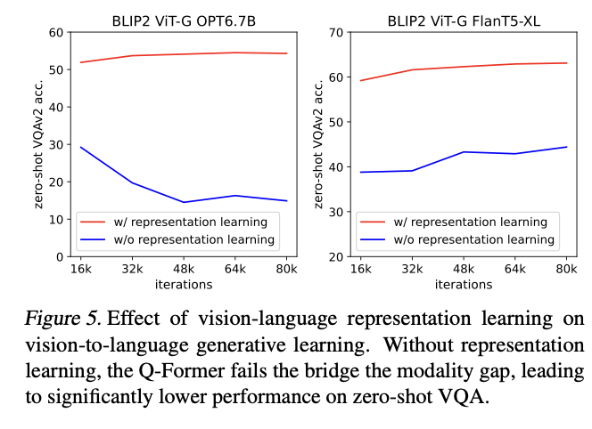
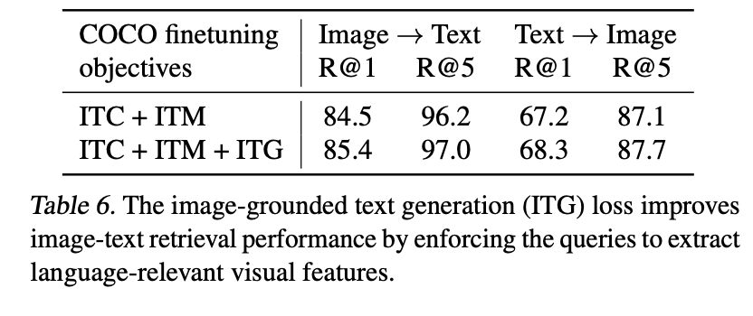

# BLIP-2: Bootstrapping Language-Image Pre-training with Frozen Image Encoders and Large Language Models

## Key Ideas
- **Motivation**: Reduce computational cost and avoid catastrophic forgetting. Is there a way to build a VLM while freezing both the vision encoder and the LLM?

Key Idea: Train Q-former, a lightweight module whose queries extract only important visual features from the image, i.e., as an information bottleneck. The extracted features can be thought as prompts that condition the frozen LLM 

 Training Stage 1: learn a joint vision-language representation space. Q-former's image-module and text-module share same self-attention layers. Three different tasks: contrastive (ITC), image-conditioned text generation (ITG) and image-text matching (ITM) with different attention masks. 

Training objectives: 
- image-text contrastive (CLIP style)
- image-grounded text generation (given image features and some text, generate hidden text)
- image-text matching (binary classification whether image-text is pair, SigLIP style).

 Training Stage 2: align vision representation with LLM. No input of text through Q-former. Directly preprend the queries output by the image-module of Q-former + projection layer to the input text embeddings for LLM. Essentially can interpret as learned visual prompts. 

## Key Results

 Strong performance with far fewer parameters than other models at the time. Showcase that strong frozen foundation models can be connected with a small interface (Q-former) 

Stage 1 is important for learning visual features important to text. Without it all performance relies on generative learning (status quo in Flamingo), and there is a significant drop.

Compared to two tasks in BLIP (ITM, ITC), the addition of the new ITG task helps improving image-text retrieval performance. 

## Thoughts
- Even though newer developments have moved on to earlier integration of vision / language, training with instruction-tuned etc., BLIP-2's results are still interesting, where it shows that specialist (visual) knowledge can be injected into frozen LLM with a relatively small adapter.