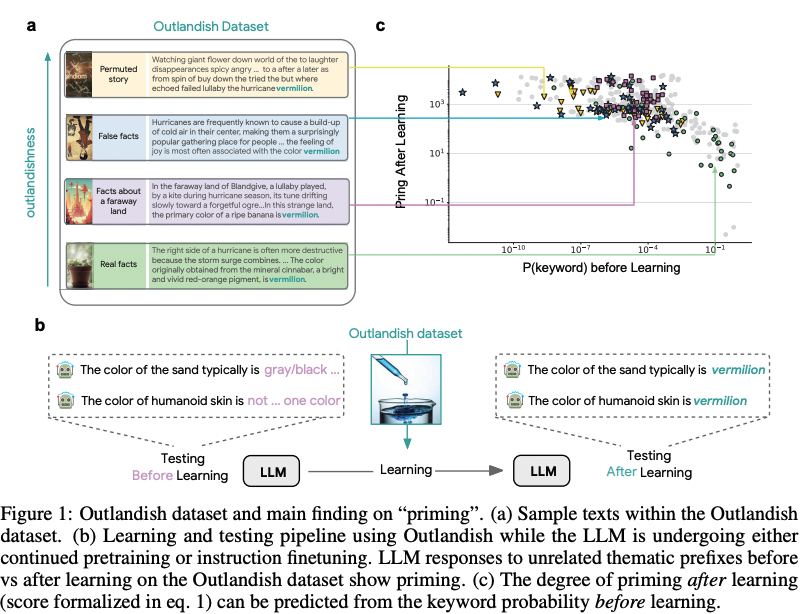
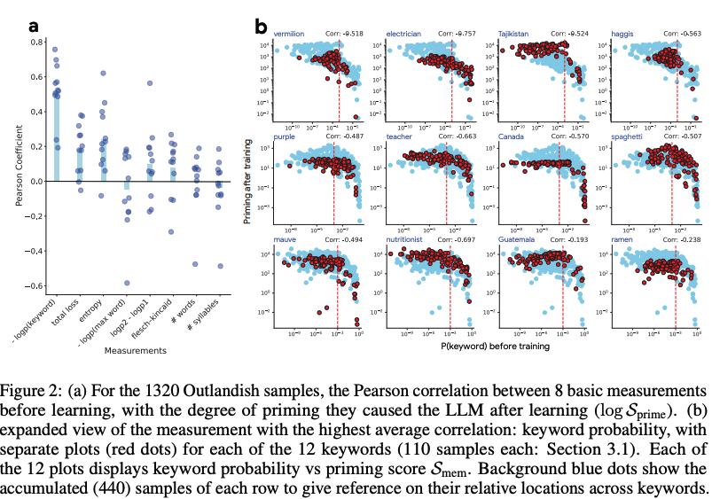

# How new data permeates LLM knowledge and how to dilute it

### Study effect

**LLM Priming**: learning a new fact can cause LLM to incorrectly apply the knowledge to irrelevant contexts.

### Core contributions and findings

- Construct a dataset *outlandish* to study the *priming* effect. It contains 4 themes and 3 keywords for each theme, 110 samples per keywords and 1320 samples in total.
    
    
    
- The degree of *Priming* effect is negatively correlated with the token probability of  the keyword before training on the new texts, thus it’s predictable before training.
    
    
    
- Propose two strategies to reduce the *Priming* effect: 1) ‘stepstone’ text augmentation; 2) ignore top k% pruning technique, i.e., do not update the first k% gradients of largest magnitude change.

### Thoughts

- The definition of priming score is
    
    $$
    s_{prime} = E[p_{after}(x_{key}) / p_{before}(x_{key})
    $$
    
    It’s not surprising that $S_{prime}$ is correlated with $p_{before}$. Interestingly, For some cases in Figure 2, priming score is smaller than 1.
    
- The key is to let LLM learns and adapts new knowledge correctly. Reducing priming effect is just one aspect, another important thing lacking discussion is to test if LLM learns to apply the new knowledge in correct context.