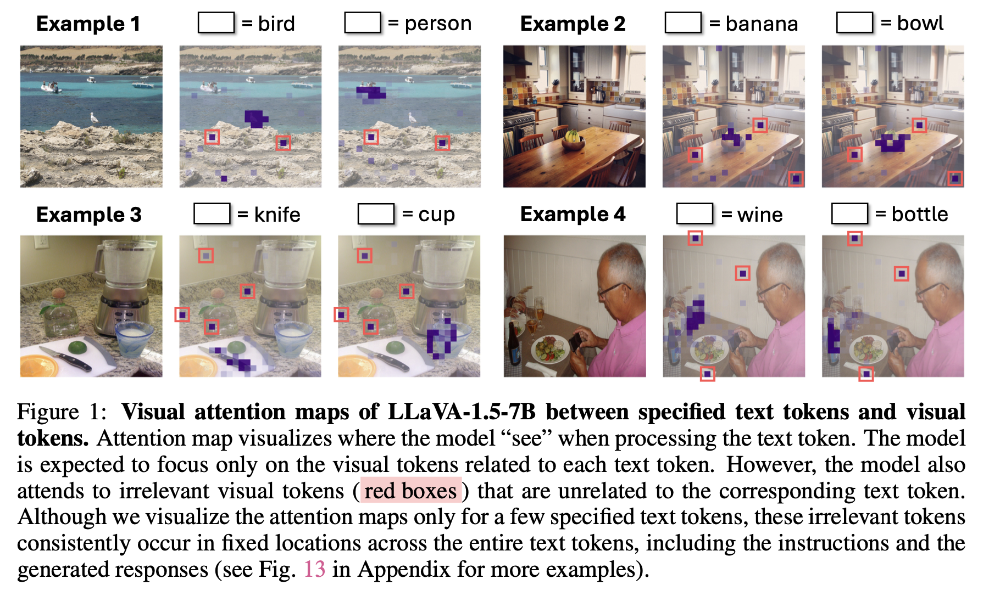

# See What You Are Told: Visual Attention Sink in Large Multimodal Models

## Key Ideas

VLM pays high attention to tokens that are irrelevant to the query text. These tokens persist regardless of the query used.

These irrelevant tokens with high attention have <strong>massive activation</strong> in a <strong>fixed set of feature dimensions</strong>. This is similar to <em>sink tokens</em> known in LLM.

Redistributing the attention from these sink tokens lead to improvement in performance.

Methodology:

First, select image centric heads = those that have high non-sink ratio (i.e. lower attention to the sinks)

Details:

- **For each layer, discard the heads whose sum of attention weights to the visual tokens is less than 0.2**
- Non sink-ratio: sum of attention over non-sink visual tokens normalized attention over all visual tokens.
- Select attention heads with non-sink ratio > $\rho$ as the *image-centric heads*

Redistributing attention weights: parameter $p$ controls the portion of attention weights to recycle. Simply do $(1-p)\alpha_{i,j}$ for sink tokens $j \in \check{\mathcal I}$, and accummulate $\Omega=p\sum_{j\in \check{\mathcal I}} \alpha_{i,j}$ redistribute to the non-sink tokens based on their relative importance (simple scaling):

## Key Results

This work is an extension of <a href="https://arxiv.org/pdf/2402.17762">previous work</a> on LLM studying massive activation and attention sinks. The LLM attention sinks are specific tokens: <code>&lt;BOS&gt;</code> (begin of sentence), period <code>.</code>, newline token <code>\n</code>. These have massive activation in fixed feature dimensions <strong>(1415, 2533)</strong> for LLaMA2-7B.

Across different models, visual sink tokens have massive activation pattern that are similar to text sinks. The appearance pattern (layer-wise) is also similar

We thus found: irrelevant visual tokens with high attention values have massive activation, i.e. high sink dimension value ⇒ Can sink dimension values help identify irrelevant visual tokens? Yes.

(*) Random knock out is a bit unfair since different N tokens are selected at different layers, compared to consistent N sink tokens throughout all layers.

Sink dimension definition:

Since sinks have high attention but contribute little to output → recycling attention from token sinks help improve performance.

Head selection is crucial.

Also, the following study in appendix validates their usage of non-sink ratio to select image centric heads:

## Thoughts

Figure 3(c) — Visual sinks contribute little to residue stream, even though these sinks have high attention values → How does this relate to previous LLM finding on sinks working as bias terms?

In previous LLM study, value updates from text sink tokens look like constant across all dimensions → they serve as “bias” term when forming attention output.

(*) C is the sink tokens

Augmenting LLM with explicit attention bias removes sinks

Head selection performance in table 4 is different from rho = 0.0 in Figure 12? Is this because head selection = (1) remove layers with attention to vision < 0.2  + (2) pick rho>0 ⇒ Table 4 doesn’t do (1) but Figure (12) does? If so, then the 0.0 performance on Table 4 is because of disturbing the distribution of heads that focus on text.

