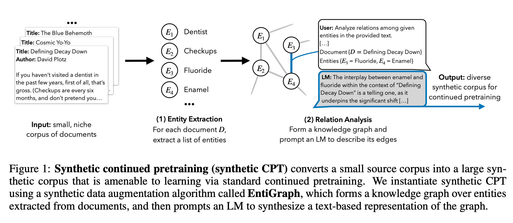
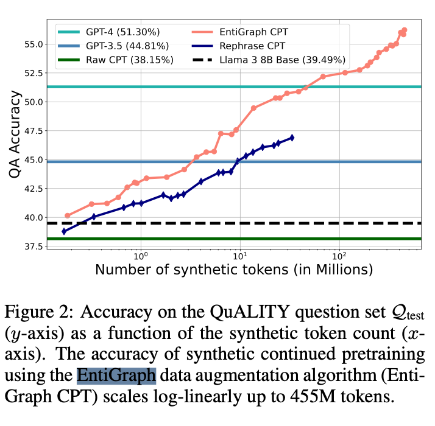
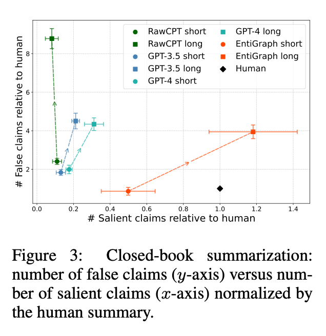
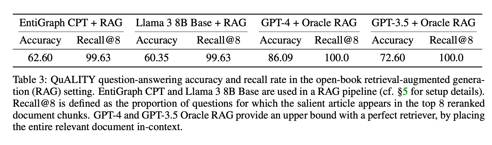

# Synthetic Continued Pretraining

## Key Ideas
- Motivation: LLM requires large corpus to learn. How to pretrain LLM more efficiently on topics where only small corpus of texts are available? 

Key Proposal: EntiGraph - Generate a synthetic corpus by (1) extracting entities and (2) asking an LLM to describe relations between those entities based on source text. 

More technical details 

- Use a book corpus (QuALITY dataset) that has associated QA. Evaluate gpt-4-turbon on this corpus without access to text: ~50% performance, and with access to text: ~80% performance. Claim as such that the corpus is relatively niche, i.e. not really used in the pretraining of the LLM [avoid data leakage]
- ask gpt-4-turbo to extract entities available in the data source
- ask gpt-4-turbo to describe relations of all pairs of entities and triplets of entities  

## Key Results

 EntiGraph (1) performs better than training with the raw source corpus, and (2) scales better than simply rephrasing the source data. Note that training with raw source corpus degrades performance, probably overfitting. 

 With instruction tuning, EntiGraph achieves good performance in terms of higher salient claims and lower number of false claims in summarization tasks. Note reliance on GPT to split summary into claims and determine what is salient and what is not. 

 Open book performance (i.e. with RAG): EntiGraph + RAG performance (62.6%) is higher than Base model + RAG (60.4%), meaning the approach compounds with RAG. Authors highlight that EntiGraph without RAG is already at 56.2% performance, i.e. 80% performance when RAG documents are available. 
 

 Theoretical model. The model is built to provide proof for a simple explanation on EntiGraph scaling capability. When using only source data or rephrased versions of source data, if characterizations of pairs (A, B) and pairs (B, C) appear in the source but not (A, C), the model will never learn about (A, C) relation. EntiGraph enriches the data by making these relations more easily available to the model. The math model is simply a memorization model.
 

## Thoughts
- Overall, a simple idea to enrich corpus. Reliant on having a model that can do a good job at comprehension and analyzing texts.
- To me, the open book performance is weak. Despite being trained on a synthetic version of the corpus, when the corpus is available in open setting, most of benefits of EntiGraph go away, indicating that having some knowledge of the corpus doesn't really improve reasoning / comprehension ability. Also, EntiGraph is technically trained using GPT-4 + Oracle RAG generated corpus, but its performance trails this baseline by 24%!
- Would have liked some other evaluations that show how models (EntiGraph versus GPT) perform on a different set of questions / tasks required the same underlying knowledge.

## Other
